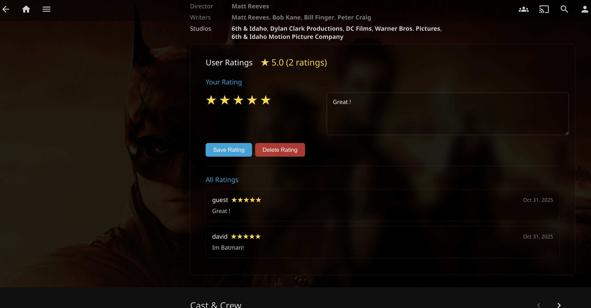

# Jellyfin User Ratings Plugin

**Rate and review content with other users on your Jellyfin server**

[](https://opensource.org/licenses/MIT)
[](https://jellyfin.org/)

A social rating system for Jellyfin that lets users rate movies, TV shows, episodes, and music, then see what other users on the server think!

> **Note:** Currently supports **web UI only**. 

---

## Screenshots

### Desktop/Web Browser



---

## Features

- ⭐ Rate any content 1-5 stars
- 👥 See ratings from other users on your server
- 📊 Average ratings displayed automatically
- 💬 Optional notes/comments with ratings
- 📺 Works on movies, TV shows, episodes, and music
- 🌐 Web interface support (desktop & mobile browsers)

## Installation

1. Open **Jellyfin Dashboard** → **Plugins** → **Repositories**
2. Add repository URL:
   ```
   https://raw.githubusercontent.com/aG00Dtime/Jellyfin.Plugin.UserRating/main/manifest.json
   ```
3. Go to **Catalog**, find **User Ratings**, and install
4. Restart Jellyfin

## Setup

**No setup required!** After installing and restarting Jellyfin, the ratings UI will automatically appear on item detail pages when accessing Jellyfin through a web browser.

## Usage

1. Open Jellyfin in a **web browser** (desktop or mobile)
2. Navigate to any **movie, TV show, episode, or music** item detail page
3. Scroll down - the **User Ratings** section appears at the bottom of the detail section
4. **Rate with 1-5 stars** by clicking the stars
5. Optionally **add a note** to share your thoughts
6. Click **Save Rating**
7. See **all ratings** from other users below your rating!

### Features

- ⭐ **Your rating** - visible stars you can click to change
- 📝 **Optional notes** - add comments with your rating
- 👥 **Other users' ratings** - see everyone's ratings and notes
- 📊 **Average rating** - calculated automatically
- 🗑️ **Delete rating** - remove your rating anytime

## Configuration

**Dashboard** → **Plugins** → **User Ratings**


## Use Cases

**Family Server**
- See what family members think before watching
- Share opinions about shows and episodes

**Friend Group**
- "Dad rated Breaking Bad S01E01 5 stars - Amazing pilot!"
- "Mom: 3/5 - Too violent for me"
- Average: 4.2/5 stars from 3 users


## License

MIT License - see [LICENSE](LICENSE) file for details.

---

Made for the Jellyfin community

